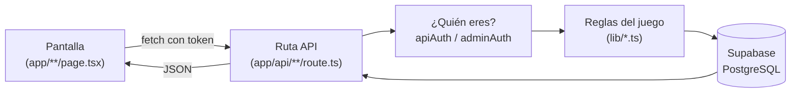

# Guía para leer el código de MudHakar

Esta guía es para leer el proyecto entero sin perderte. Va en orden: cada fase
se apoya en la anterior. **No saltes fases** y, sobre todo, **no empieces por
los archivos grandes** — son los que peor se entienden en frío.

---

## 0. Lo mínimo que hay que saber antes de abrir un archivo

Cinco ideas. Con esto ya puedes leer el 90% del proyecto.

### 1. Hay dos mundos: navegador y servidor

El mismo lenguaje (TypeScript) corre en dos sitios distintos, y **la diferencia
lo explica casi todo**:

| | Navegador (cliente) | Servidor |
|---|---|---|
| Archivos | los que empiezan con `"use client"` | `app/api/**/route.ts` y `lib/*Server*` |
| Quién lo controla | **el usuario** — puede modificarlo | **tú** — es de fiar |
| Ve las claves secretas | ❌ nunca | ✅ sí |

Regla que atraviesa todo el proyecto: **lo que decide el navegador es una
sugerencia; lo que decide el servidor es la verdad.** Cuando veas la misma
validación repetida en los dos sitios, no es un descuido: la del navegador es
para que la pantalla responda rápido, la del servidor es la que manda.

### 2. Una "ruta API" es una función que responde a una URL

En `app/api/tiendas/comprar/route.ts` hay una función `POST`. Eso significa:
cuando alguien hace una petición POST a `/api/tiendas/comprar`, se ejecuta esa
función. **La carpeta es la URL.** No hay ningún archivo de configuración que
las conecte; Next.js lo hace por la ruta del archivo.

Lo mismo con las páginas: `app/gremio/page.tsx` es la pantalla `/gremio`.
Los corchetes son partes variables: `app/partidas/[id]/page.tsx` responde a
`/partidas/lo-que-sea`, y ese valor llega como `id`.

### 3. El viaje de cualquier acción es siempre el mismo



Cuando no entiendas algo, **sitúalo en este dibujo**. Casi cualquier pregunta
("¿dónde se descuenta el oro?") se responde recorriéndolo.

### 4. Supabase es la base de datos, y a veces también la lógica

Supabase es PostgreSQL con una API encima. Verás dos formas de hablar con él:

```ts
db.from("personajes").select("...")   // consulta normal: leer o escribir una tabla
db.rpc("comprar_en_tienda", { ... })  // llamada a una función escrita EN SQL
```

Las `rpc(...)` son la parte que más despista al principio. Son funciones que
viven dentro de la base de datos (búscalas en `supabase/migrations/*.sql`) y se
usan cuando **varias cosas tienen que pasar todas o ninguna**: comprar descuenta
oro, baja stock y añade el objeto a la bolsa. Si eso se hiciera con tres
consultas sueltas y fallara la tercera, el jugador se quedaría sin oro y sin
objeto. Dentro de una función SQL es una única transacción: o todo, o nada.

> Cuando veas `.rpc("algo")` y quieras saber qué hace:
> `grep -rn "algo" supabase/migrations/`

### 5. La sesión viaja en una cabecera

Al entrar, Supabase da un **token** (un texto largo). El navegador lo manda en
cada petición dentro de la cabecera `Authorization: Bearer <token>`, y el
servidor pregunta a Supabase de quién es. Por eso verás en casi toda ruta:

```ts
const { user, error } = await getUserFromRequest(db, request);  // usuario normal
const result = await requireAdmin(request);                     // solo admin
```

Ese par de líneas es la puerta. Si una ruta no las tiene, o es pública a
propósito (noticias, feedback) o hay un problema.

---

## 1. Mapa del repositorio

```
mea-culpa/
├── app/
│   ├── page.tsx, layout.tsx     ← portada y envoltorio común
│   ├── <zona>/page.tsx          ← una carpeta = una pantalla
│   ├── components/              ← piezas de UI compartidas
│   ├── admin/                   ← el panel de administración
│   └── api/**/route.ts          ← ★ EL SERVIDOR. 79 rutas.
├── lib/                         ← ★ LAS REGLAS. Compartido por todo.
│   ├── types/                   ← formas de los datos
│   └── dice/                    ← motor de dados (el módulo mejor separado)
├── components/ui/               ← botones, inputs… sin lógica de juego
└── supabase/migrations/*.sql    ← el esquema de la BD, en orden histórico
```

Dos carpetas son el esqueleto: **`lib/` (las reglas) y `app/api/` (las
puertas)**. Todo lo demás es pantalla.

---

## 2. Orden de lectura

### Fase 1 — La columna vertebral (≈1 hora)

Archivos cortos, y sin ellos nada más se entiende. **Léelos en este orden:**

| # | Archivo | Qué te enseña |
|---|---|---|
| 1 | [lib/supabase.ts](../lib/supabase.ts) | cómo habla el **navegador** con la BD |
| 2 | [lib/supabaseServer.ts](../lib/supabaseServer.ts) | cómo habla el **servidor** (con permisos totales) |
| 3 | [lib/apiAuth.ts](../lib/apiAuth.ts) | cómo se sabe quién hace la petición |
| 4 | [lib/adminAuth.ts](../lib/adminAuth.ts) | lo mismo, exigiendo que sea admin |
| 5 | [lib/useAuth.ts](../lib/useAuth.ts) | la sesión en el navegador |
| 6 | [lib/goldService.ts](../lib/goldService.ts) | el oro: una sola puerta para tocarlo |
| 7 | [lib/characterLife.ts](../lib/characterLife.ts) | vivo / muerto / eliminado |

Al acabar deberías poder responder: *¿por qué hay dos clientes de Supabase?* y
*¿qué impide que yo mande el id del personaje de otro?*

### Fase 2 — Una acción completa, de punta a punta (≈45 min)

Ahora sigue **una sola acción** por todo el recorrido. Comprar en la tienda es
la mejor: es corta y tiene todas las piezas.

1. [app/tiendas/page.tsx](../app/tiendas/page.tsx) — busca `fetch(` (línea 262)
   y [app/components/GlobalCartWidget.tsx](../app/components/GlobalCartWidget.tsx)
   (línea 183). Ignora el resto de la pantalla: solo quieres ver **qué manda y adónde**.
2. [app/api/tiendas/comprar/route.ts](../app/api/tiendas/comprar/route.ts) —
   123 líneas, ya comentadas. Fíjate en el orden: autenticar → validar entrada →
   comprobar personaje → llamar a la RPC → traducir errores a códigos HTTP.
   **Ese orden se repite en las 79 rutas.**
3. `grep -n "comprar_en_tienda" supabase/migrations/*.sql` — ve dónde acaba de
   verdad la compra. No hace falta que entiendas el SQL línea a línea; basta con
   ver que oro, stock y bolsa se tocan juntos.

Cuando entiendas esta cadena, entiendes el proyecto. El resto es lo mismo con
más reglas.

### Fase 3 — Los sistemas de juego (≈2-3 horas)

Cada uno es independiente. Léelos en el orden que quieras, pero **uno entero
antes de pasar al siguiente**.

**Ruleta** — el más fácil, empieza por aquí.
`lib/roulette.ts` (matemáticas puras) → `lib/rouletteRewards.ts` (qué premio) →
`app/api/profile/ruleta-spin/route.ts` (junta las dos y cobra).
Lo interesante: las probabilidades son fijas en el código; los premios los edita
el admin en la BD.

**Dados** — el módulo mejor diseñado del proyecto, y el que más enseña.
`lib/dice/load.ts` → `lib/dice/engine.ts` → `lib/dice/apply.ts` →
`app/api/dados/roll/route.ts`.
Está partido en cuatro piezas a propósito: cargar, resolver, aplicar, presentar.
`engine.ts` es **puro** (mismos datos de entrada → mismo resultado, sin tocar la
BD), y por eso es el único módulo con pruebas: `lib/dice/engine.test.ts`.

**Personajes** — las reglas de D&D del proyecto.
`lib/statAllocation.ts` (los cuatro métodos de estadísticas) →
`lib/statRollToken.ts` (por qué no se puede hacer trampa tirando dados) →
`app/api/profile/create-character/route.ts`.

**Partidas** — el sistema más grande. Déjalo para el final de esta fase.
`app/api/partidas/[id]/sala/route.ts` (la foto de la sala) →
`app/components/sala-player.tsx` (vista del jugador, ~160 líneas) →
`app/components/sala-dm.tsx` (vista del DM, ~1200 líneas — aquí ya vas preparado).
Reglas asociadas: `lib/caidas.ts` y `lib/descanso.ts`, ambos cortos y muy
comentados.

**Pagos** — leer al final, y con calma.
`lib/paypal.ts` → `app/api/profile/revive-paypal/create-order/route.ts` →
`.../capture-order/route.ts` → `app/api/paypal/webhook/route.ts`.
La idea que hay que llevarse: **el resultado de un pago puede llegar por dos
caminos a la vez** (el navegador y el webhook), y el premio solo puede
entregarse una vez. Esa es la razón de la columna `effect_applied`.

### Fase 4 — Las pantallas (a demanda)

No las leas enteras. **Ábrelas cuando quieras saber quién llama a una ruta**, y
busca directamente `fetch(`.

Excepciones que sí merecen lectura completa cuando toque tocarlas:
[app/profile/page.tsx](../app/profile/page.tsx) y
[app/profile/bolsa/bolsa.tsx](../app/profile/bolsa/bolsa.tsx).

### Fase 5 — El panel de administración (solo si vas a tocarlo)

[app/admin/page.tsx](../app/admin/page.tsx) pasa de **5000 líneas**. No se lee: se
consulta. Busca la pestaña que te interesa, mira a qué ruta de `/api/admin/*`
llama, y lee esa ruta. Las pestañas son independientes entre sí.

---

## 3. Las reglas no escritas del proyecto

Cosas que se repiten en todas partes. Cuando las reconozcas, leerás mucho más rápido.

**El servidor nunca se fía del navegador.** Da igual que el modal ya haya
validado: la ruta vuelve a validar. Si encuentras una ruta que no lo hace, es un
agujero, no una optimización.

**Lo que debe pasar junto, pasa en una RPC.** Oro + inventario + registro se
tocan dentro de una función SQL para que no puedan quedar a medias.

**Todo movimiento de oro deja rastro.** Nunca se escribe `perfiles.oro` a mano:
se pasa por `modifyGold()` o por la RPC `modificar_oro`, que registran el
movimiento en `transacciones_oro`.

**Las acciones que se pueden repetir llevan un identificador.** Las tiradas de
dados mandan un `roll_id`: si la petición se reenvía (mala conexión, refresco de
página), el servidor devuelve el resultado ya guardado en vez de volver a cobrar.

**El estado de vida se comprueba antes de casi todo.** `ensureOwnedAliveCharacter()`
responde de una vez a "¿es tuyo?" y "¿está vivo?".

**Español en la BD, inglés en el código.** Las tablas y columnas están en
español (`personajes.capacidad_bolsa`) y buena parte del código en inglés
(`bagCapacity`). Los archivos `map*Rows` de `lib/dice/load.ts` existen justo
para traducir entre los dos.

**Los comentarios `ponytail:` marcan simplificaciones deliberadas** con su
límite conocido y cómo mejorarlas si hace falta. No son deudas olvidadas.

---

## 4. Cómo buscar cosas

```bash
# ¿Quién llama a esta ruta?
grep -rn "api/tiendas/comprar" app/

# ¿Qué hace esta función SQL?
grep -rn "comprar_en_tienda" supabase/migrations/

# ¿Dónde se usa esta tabla?
grep -rn 'from("personajes")' app/ lib/

# ¿Cuándo se añadió esta columna? (las migraciones van en orden)
grep -rln "capacidad_bolsa" supabase/migrations/
```

También tienes el índice del grafo de código (`codebase-memory`): sirve para
preguntar quién llama a qué sin ir archivo por archivo.

---

## 5. Trampas que confunden al principio

**`any` por todas partes.** Verás mucho `(data as any).campo`. Es una forma de
decirle a TypeScript "confía en mí" con los datos que vuelven de Supabase. Feo,
pero no cambia el comportamiento: ignóralo al leer.

**`?.` y `??`.** `a?.b` significa "b, y si a no existe no revientes, da
`undefined`". `a ?? b` significa "a, salvo que sea null/undefined; entonces b".
Aparecen en cada línea.

**Dos archivos de migración con el mismo número** (hay dos `042_` y dos `048_`).
Es un descuido histórico, no una pista de nada.

**`app/components/` no es `components/`.** El primero tiene componentes con
lógica del juego; el segundo (en la raíz) son piezas genéricas de UI sin nada de
MudHakar dentro.

**Cabecera y navegación aparecen sin que las importe cada pantalla**: están en
`app/layout.tsx`, que envuelve a todas.

---

## 6. Chuleta: dónde vive cada cosa

| Si te preguntas… | Mira en |
|---|---|
| ¿Cómo se descuenta el oro? | `lib/goldService.ts` + RPC `modificar_oro` |
| ¿Quién puede hacer esto? | `lib/apiAuth.ts`, `lib/adminAuth.ts` |
| ¿Cómo se muere un personaje? | `lib/characterLife.ts` |
| ¿Qué probabilidad tiene el jackpot? | `SLOT_COUNTS` en `lib/roulette.ts` |
| ¿Cómo se decide una tirada de dados? | `resolveRoll()` en `lib/dice/engine.ts` |
| ¿Cuánto cabe en la bolsa? | `personajes.capacidad_bolsa`, derivada de la Fuerza |
| ¿Qué pasa al acabar una partida? | `app/api/admin/partidas/route.ts` (PATCH) |
| ¿Por qué no puedo comprar en partida? | `lib/partidasState.ts` y la RPC de compra |
| ¿Qué columnas tiene esta tabla? | `supabase/migrations/`, de atrás hacia delante |
